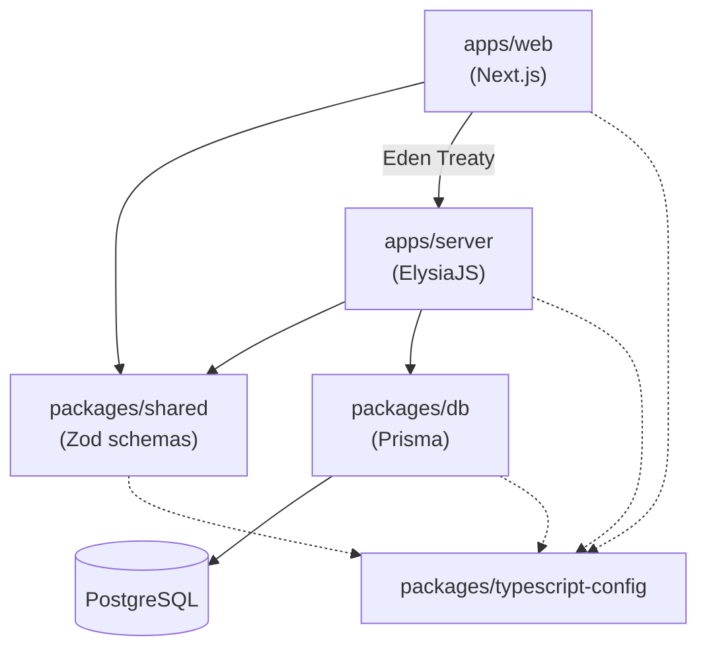

# Blueprint

Modern, type-safe full-stack monorepo — **Next.js 16** frontend + **ElysiaJS** backend with end-to-end type safety via Eden Treaty.

## Quick Start

### Prerequisites

- [Bun](https://bun.sh/) ≥ 1.3.9
- [Node.js](https://nodejs.org/) ≥ 18 (Next.js runtime)
- PostgreSQL database (e.g. [Supabase](https://supabase.com/))

### Setup

```bash
# 1. Install dependencies
bun install

# 2. Configure environment variables
cp apps/server/.env.example apps/server/.env
cp apps/web/.env.example    apps/web/.env
cp packages/db/.env.example packages/db/.env
# → Edit each .env file with your values

# 3. Generate Prisma client & run migrations
bun run db:generate
bun run db:migrate

# 4. Start development (all apps)
bun run dev
```

| Service  | URL                    |
|----------|------------------------|
| Frontend | http://localhost:3000   |
| API      | http://localhost:3001   |

---

## Architecture

```
blueprint/
├── apps/
│   ├── web/          → Next.js 16 (React 19) — frontend
│   └── server/       → ElysiaJS on Bun — REST API
├── packages/
│   ├── db/           → Prisma ORM + PostgreSQL schema
│   ├── shared/       → Zod schemas, types & constants
│   └── typescript-config/  → Shared TS configs
├── documents/        → Project specs & blueprints
├── turbo.json        → Turborepo pipeline config
└── package.json      → Root workspace
```

### Dependency Flow



---

## Tech Stack

| Layer            | Technology                                   |
|------------------|----------------------------------------------|
| **Frontend**     | Next.js 16, React 19, Tailwind CSS v4        |
| **UI Components**| shadcn/ui (New York), Radix UI, Lucide React |
| **Forms**        | React Hook Form + Zod validation             |
| **Server State** | TanStack Query v5                            |
| **Backend**      | ElysiaJS on Bun runtime                      |
| **API Contract** | Eden Treaty (end-to-end type inference)       |
| **Database**     | PostgreSQL via Supabase                       |
| **ORM**          | Prisma 6                                     |
| **Auth**         | Custom JWT (Argon2 via `Bun.password`)        |
| **E2E Testing**  | Playwright                                   |
| **Build System** | Turborepo + Bun workspaces                   |

---

## Scripts

Run from the project root:

| Command            | Description                              |
|--------------------|------------------------------------------|
| `bun run dev`      | Start all apps in development mode       |
| `bun run build`    | Build all apps for production            |
| `bun run lint`     | Lint all packages                        |
| `bun run type-check` | Type-check all packages                |
| `bun run db:generate` | Generate Prisma client                |
| `bun run db:migrate`  | Run database migrations               |

---

## Configuration

### Environment Variables

#### `apps/server/.env`

| Variable       | Description                      | Default                |
|----------------|----------------------------------|------------------------|
| `DATABASE_URL` | PostgreSQL connection string     | —                      |
| `JWT_SECRET`   | Secret for signing JWTs          | `dev-secret-…`         |
| `PORT`         | API server port                  | `3001`                 |

#### `apps/web/.env`

| Variable              | Description          | Default                  |
|-----------------------|----------------------|--------------------------|
| `NEXT_PUBLIC_API_URL` | Backend API URL      | `http://localhost:3001`  |

#### `packages/db/.env`

| Variable       | Description                      | Default |
|----------------|----------------------------------|---------|
| `DATABASE_URL` | PostgreSQL connection string     | —       |

---

## Documentation

- [API Reference](docs/api-reference.md)
- [Architecture Guide](docs/architecture.md)
- [Project Blueprint](documents/blueprint_eng.md)

---

## License

MIT
