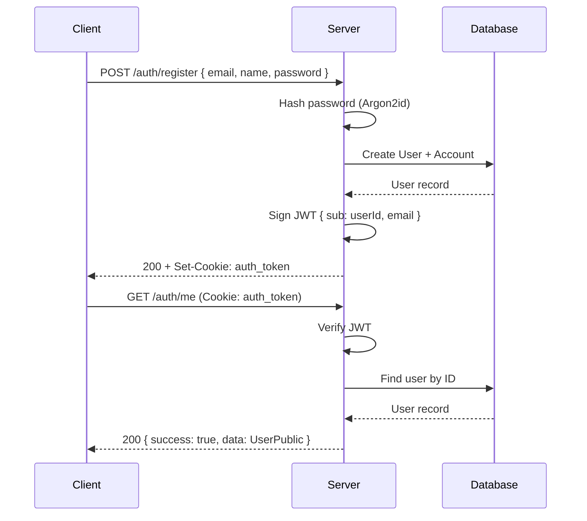

# API Reference

> Blueprint API — ElysiaJS backend running on Bun.

**Base URL:** `http://localhost:3001`

---

## Health Check

### `GET /`

Returns the API status.

**Response:**
```json
{
  "name": "Blueprint API",
  "version": "0.0.1",
  "status": "ok"
}
```

---

## Authentication

All auth endpoints are prefixed with `/auth`.

Session is managed via a JWT stored in an HTTP-only cookie (`auth_token`). The token expires after **7 days**.

---

### `POST /auth/register`

Create a new user account.

**Request Body:**

| Field      | Type   | Required | Validation                 |
|------------|--------|----------|----------------------------|
| `email`    | string | Yes      | Valid email format          |
| `name`     | string | Yes      | Min 2 characters            |
| `password` | string | Yes      | Min 8 characters            |

**Success Response (200):**
```json
{
  "success": true,
  "data": {
    "id": "clx1abc...",
    "email": "user@example.com",
    "name": "John",
    "createdAt": "2025-01-01T00:00:00.000Z"
  }
}
```

**Error Response (400):**
```json
{
  "success": false,
  "message": "User with this email already exists"
}
```

**Side Effect:** Sets `auth_token` cookie on success.

---

### `POST /auth/login`

Authenticate an existing user.

**Request Body:**

| Field      | Type   | Required | Validation           |
|------------|--------|----------|----------------------|
| `email`    | string | Yes      | Valid email format    |
| `password` | string | Yes      | Min 8 characters     |

**Success Response (200):**
```json
{
  "success": true,
  "data": {
    "id": "clx1abc...",
    "email": "user@example.com",
    "name": "John",
    "createdAt": "2025-01-01T00:00:00.000Z"
  }
}
```

**Error Response (401):**
```json
{
  "success": false,
  "message": "Invalid email or password"
}
```

**Side Effect:** Sets `auth_token` cookie on success.

---

### `POST /auth/logout`

Clear the authentication cookie.

**Request Body:** None.

**Response (200):**
```json
{
  "success": true,
  "message": "Logged out successfully"
}
```

**Side Effect:** Removes `auth_token` cookie.

---

### `GET /auth/me`

Get the currently authenticated user's profile.

**Authentication:** Requires valid `auth_token` cookie.

**Success Response (200):**
```json
{
  "success": true,
  "data": {
    "id": "clx1abc...",
    "email": "user@example.com",
    "name": "John",
    "createdAt": "2025-01-01T00:00:00.000Z"
  }
}
```

**Error Responses:**

| Status | Message            |
|--------|--------------------|
| 401    | Not authenticated  |
| 401    | Invalid token      |
| 404    | User not found     |

---

## Response Types

All API responses follow a consistent envelope:

```typescript
interface ApiResponse<T = unknown> {
  success: boolean;
  data?: T;
  message?: string;
}
```

### `UserPublic`

Returned by all auth endpoints on success:

```typescript
interface UserPublic {
  id: string;
  email: string;
  name: string | null;
  createdAt: Date;
}
```

---

## Authentication Flow


