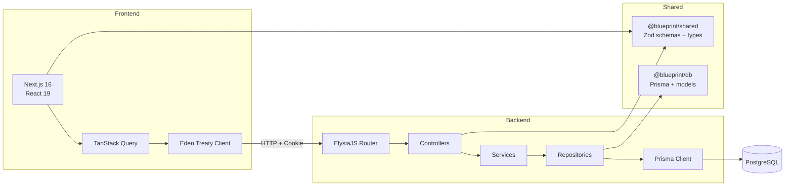
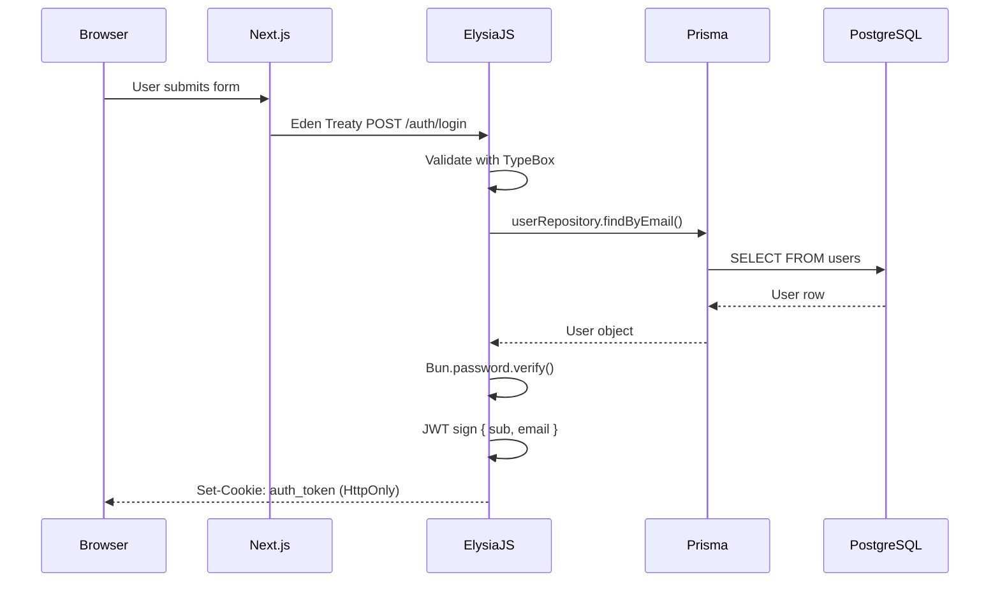

# Architecture Guide

> In-depth look at how Blueprint is structured, how data flows, and the design decisions behind the stack.

---

## High-Level Overview

Blueprint is a **Turborepo monorepo** with two apps and three shared packages. The core design principle is **end-to-end type safety** — from database schema to API contract to UI — with zero duplicated type definitions.



---

## Monorepo Structure

### `apps/web` — Frontend

| Concern        | Solution                              |
|----------------|---------------------------------------|
| Framework      | Next.js 16 (App Router, React 19)     |
| Styling        | Tailwind CSS v4, `cn()` utility       |
| UI Library     | shadcn/ui (New York style), Radix UI  |
| Icons          | Lucide React                          |
| Forms          | React Hook Form + Zod resolvers       |
| Server State   | TanStack Query v5                     |
| API Client     | Eden Treaty (type-inferred from server) |
| E2E Tests      | Playwright (Chromium)                 |

**Key files:**

| Path                          | Purpose                                  |
|-------------------------------|------------------------------------------|
| `src/app/layout.tsx`          | Root layout with fonts & providers       |
| `src/app/page.tsx`            | Home page                                |
| `src/lib/api.ts`              | Eden Treaty client instance              |
| `src/lib/utils.ts`            | `cn()` Tailwind class merge utility      |
| `src/providers/query-provider.tsx` | TanStack QueryClient provider       |
| `src/components/ui/`          | shadcn/ui components (Button, Card, etc.)|
| `e2e/`                        | Playwright test specs                    |
| `playwright.config.ts`        | Playwright config (Chromium, `:3000`)    |

### `apps/server` — Backend API

| Concern        | Solution                              |
|----------------|---------------------------------------|
| Framework      | ElysiaJS on Bun                       |
| Auth           | JWT (`@elysiajs/jwt`) + HTTP-only cookies |
| Hashing        | Argon2id via `Bun.password`          |
| CORS           | `@elysiajs/cors`                     |
| Validation     | TypeBox (`t`) per-endpoint           |

**Layered architecture:**

```
Controller  →  receives HTTP, validates input, returns response
   ↓
Service     →  business logic, hashing, error handling
   ↓
Repository  →  Prisma database queries
```

**Key files:**

| Path                                    | Purpose                          |
|-----------------------------------------|----------------------------------|
| `src/index.ts`                          | App entry, CORS, routes, export `App` type |
| `src/controllers/auth.controller.ts`    | Auth routes (register/login/logout/me) |
| `src/services/auth.service.ts`          | Auth business logic              |
| `src/repositories/user.repository.ts`   | Prisma user queries              |

### `packages/db` — Database

Prisma ORM package shared across apps.

**Schema models:**

| Model     | Table      | Purpose                                  |
|-----------|------------|------------------------------------------|
| `User`    | `users`    | Core user (email, name, nullable password)|
| `Account` | `accounts` | Auth providers (credentials, future OAuth)|

**Key design decisions:**
- `password` is **nullable** to support future OAuth-only users
- `Account` model allows linking multiple providers to one user
- Uses `cuid()` for primary keys

### `packages/shared` — Shared Types & Validation

Single source of truth for types used by both frontend and backend.

**Exports:**

| Export             | Type     | Description                        |
|--------------------|----------|------------------------------------|
| `loginSchema`      | Zod      | Login form validation              |
| `registerSchema`   | Zod      | Registration form validation       |
| `LoginInput`       | Type     | Inferred from `loginSchema`        |
| `RegisterInput`    | Type     | Inferred from `registerSchema`     |
| `ApiResponse<T>`   | Interface| Standard API response envelope      |
| `UserPublic`       | Interface| Public user data (no password)     |
| `APP_NAME`         | Const    | `"Blueprint"`                      |
| `AUTH_COOKIE_NAME` | Const    | `"auth_token"`                     |

### `packages/typescript-config` — TS Configs

| Config        | Used by          | Adds                          |
|---------------|------------------|-------------------------------|
| `base.json`   | All packages     | Strict mode, ES2022, bundler  |
| `nextjs.json` | `apps/web`       | DOM libs, JSX, Next.js plugin |
| `server.json` | `apps/server`    | Server-only ES2022            |

---

## End-to-End Type Safety

The type safety chain works like this:

```
Prisma schema  →  generates @prisma/client types
                     ↓
              @blueprint/db re-exports types
                     ↓
           apps/server uses in repositories
                     ↓
          ElysiaJS infers route types from handlers
                     ↓
            export type App = typeof app
                     ↓
         Eden Treaty infers client types from App
                     ↓
           apps/web gets fully typed API calls
```

This means **adding a field to the Prisma schema** automatically flows through the entire stack — no manual type syncing required.

---

## Authentication Architecture



**Security details:**
- Passwords hashed with **Argon2id** (`memoryCost: 19456, timeCost: 2`)
- JWT stored in **HTTP-only, secure, SameSite=Lax** cookie
- Token expires after **7 days**
- CORS restricted to `WEB_URL` origin with credentials

---

## Development Workflow

When adding a new feature, follow this order:

1. **Database** — Modify `packages/db/prisma/schema.prisma`, run `bun run db:migrate`
2. **Backend** — Add repository → service → controller in `apps/server`
3. **Types** — Export shared types/schemas from `packages/shared`
4. **Frontend** — Create TanStack Query hooks using the Eden client, build pages with shadcn/ui
5. **Test** — Write Playwright E2E tests in `apps/web/e2e/`
